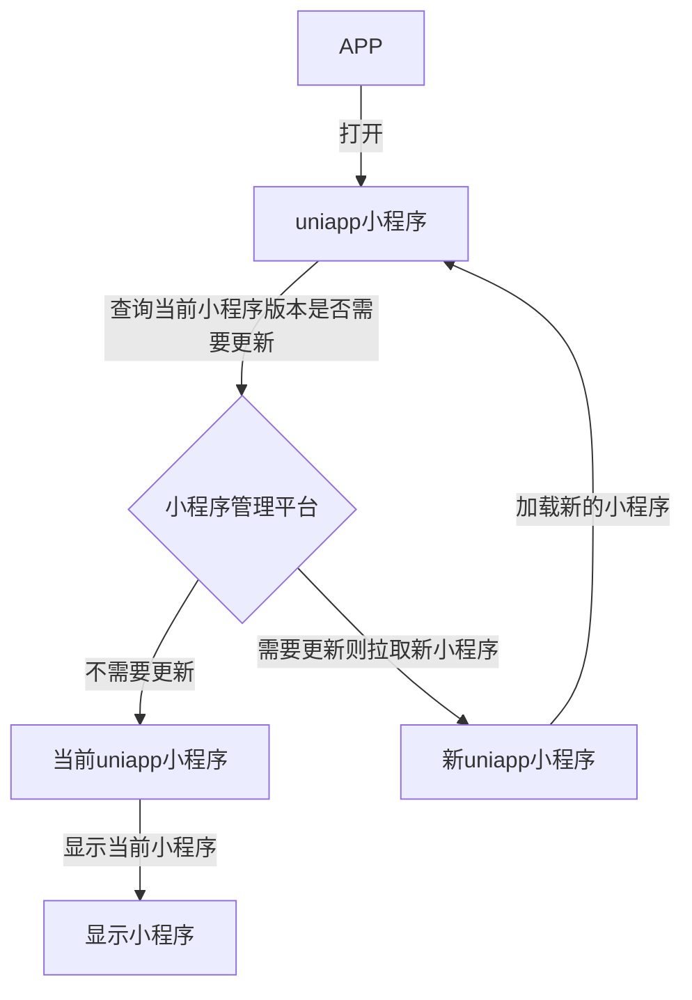
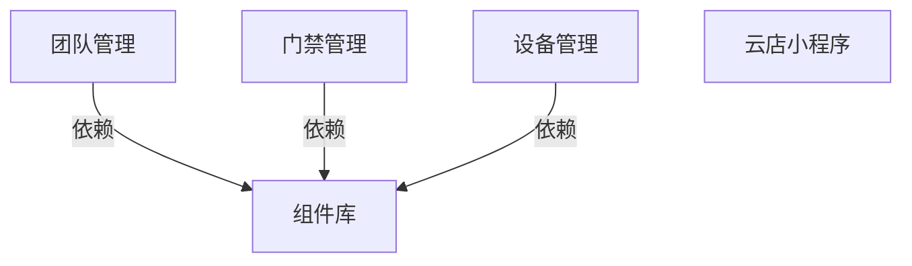
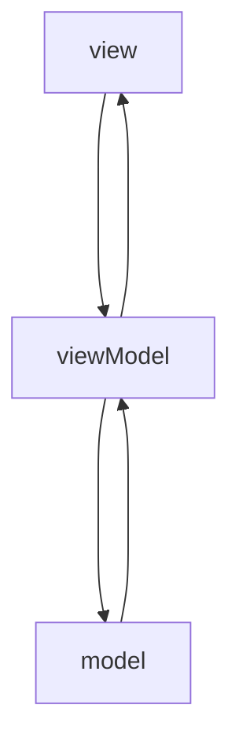

[TOC]


| 版本      | 负责人 | 日期                   | 内容     |
| --------- | ------ | ---------------------- | -------- |
| V0.1/草稿 | 李政29 | 2021-05-10 -2021-06-03 | 创建文档 |


# 项目背景

为了能够更好的管理项目，以及最大程度复用代码，针对海康互联APP融合版本采用内嵌uniapp小程序的架构，同时小程序部分也能够发布到微信小程序平台，因为针对此需求，需要设计一个插件化方案，能够兼容微信小程序，以及uniapp小程序（也就是内嵌到APP的小程序，后续统称uniapp小程序）。

# Uniapp SDK

uni小程序SDK，是为原生App打造的可运行基于 uni-app 开发的小程序前端项目的框架，从而帮助原生App快速获取小程序的能力。

参考链接：https://nativesupport.dcloud.net.cn/README

## 优势

1. 宿主App构建自己的应用生态，可以面向广泛开发者，也可以定向部分开发者

2. 原生App利用小程序模式对模块解耦，让不同模块的开发团队各自独立发版，灵活更新

3. 原生App中部分功能使用uni-app实现，降低开发成本、提升发布效率

## 集成流程

1. 宿主开发者下载uni小程序sdk，根据文档集成到宿主App中

2. 小程序开发者使用 HBuilderX 创建 uni-app 项目并开发功能，开发阶段可以直接在 HBuilderX 内置基座进行测试，开发完毕后在发行菜单导出wgt包

3. 宿主开发者将 wgt 集成到宿主App中，可离线集成直接打包进去，也可以在线下载wgt

4. 通过 uni小程序sdk 的 api 将 wgt 资源部署到运行路径，然后即可跳转到该资源对应的小程序应用中

5. uni小程序支持 wgt升级，可以在小程序中直接调用 api 在线更新 wgt 资源，即热更新

## uniapp小程序升级方案

### 小程序在线升级方案（支持增量更新）

参考链接：https://ask.dcloud.net.cn/article/35667

升级方案：

1. 修改manifest.json中的版本号，比如之前是1.0.0，新版本应该修改为1.0.1或者1.1.0

2. 在HBuildX中生成wgt资源升级包（菜单->发行->原生APP-制作移动App资源升级包），生成结束后会在控制台告知升级包的输出位置
3. 将wgt包上传到小程序管理平台
4. 应用的升级需要服务端与客户端配合完成，具体方案需要和APP端讨论决定。



**不支持的情况：**

1. uniapp的SDK有调整，需要整包升级

2. 原生插件有修改，同样需要整包升级

**注意事项：**

1. 条件编译，仅在 App 平台执行此升级逻辑。

2.   appid 以及版本信息等，在 HBuilderX 真机运行开发期间，均为 HBuilder 这个应用的信息，因此需要打包自定义基座或正式包测试升级功能。

3.   plus.runtime.version 或者 uni.getSystemInfo() 读取到的是 apk/ipa 包的版本号，而非 manifest.json 资源中的版本信息，所以这里用 plus.runtime.getProperty() 来获取相关信息。

4. 安装 wgt 资源包成功后，必须执行 plus.runtime.restart()，否则新的内容并不会生效。

5.   如果App的原生引擎不升级，只升级wgt包时需要注意测试wgt资源和原生基座的兼容性。平台默认会对不匹配的版本进行提醒，如果自测没问题，可以在manifest中配置忽略提示，详见https://ask.dcloud.net.cn/article/35627

**使用热更新需要注意：**

1. 上架审核期间不要弹出热更新提示

2. 热更新内容使用https下载，避免被三方网络劫持

3. 不要更新违法内容、不要通过热更新破坏应用市场的利益，比如iOS的虚拟支付要老老实实给Apple分钱

### 整包升级方案

如果APP有大版本更新，直接打包成wgt包和APP一起发布即可。

### TODO

1. wgt编译是编译在哪个平台？应该是微信小程序平台？

## 注意事项

1. 目前 uni小程序sdk 仅支持在原生App中集成使用，暂不支持 HBuilderX 打包生成的App中集成

2. 目前 uni小程序sdk 仅支持同时运行一个小程序实例，启动下一个小程序需关闭上一个小程序

3.   uni 小程序 sdk 无法使用插件市场中付费的原生插件

## 小程序与原生通信方式

### 启动小程序传参

宿主启动小程序时支持传入参数到小程序环境，小程序中可以通过 plus.runtime.arguments 获取宿主传入的参数。

### APP和小程序通信

小程序监听事件：

```js
uni.onNativeEventReceive((event,data)=>{
  console.log('接收到宿主App消息：' + event + data);
  this.nativeMsg = '接收到宿主App消息 event：' + event + " data: " + data;
})
```

| **属性**  | **类型**       | **说明**   |
| --------- | -------------- | ---------- |
| **Event** | String         | 事件名称   |
| **Data**  | String或者JSON | 传递的数据 |

小程序发送事件：

```js
uni.sendNativeEvent(event, data, callback)
```

| **属性**     | **类型**       | **说明**   |
| ------------ | -------------- | ---------- |
| **Event**    | String         | 事件名称   |
| **Data**     | String或者JSON | 传递的数据 |
| **Callback** | Function       | 回调方法   |

## 开启后台运行

通过 DCSDKInitConfig配置setEnableBackground小程序是否支持后台运行，默认点击胶囊按钮的x或者在小程序中调用plus.runtime.quit()方法会直接关闭小程序，当开启后台运行时会只是将小程序隐藏到后台，下次打开时直接显示之前的状态。

由于uniapp sdk只支持一个小程序的运行，因此建议此配置为不支持后台运行。

# uniapp小程序架构设计

由于多个小程序UI风格类似，因此可以抽象出组件库以复用。




## 安装使用

由于小程序不同于web端，没法通过script引入库文件，所以组件库没法编译成应用组件或者lib库的方式，只能通过下载组件库到本地进行引用，一起编译打包。

| 组件库使用方案 | 优点                                                  | 缺点                                           |
| -------------- | ----------------------------------------------------- | ---------------------------------------------- |
| npm            | 1. 管理集中<br />2. 使用简单明了<br />3. 项目构建方便 | 1. npm发布有缓存和延迟，会导致使用旧的资源     |
| 私立npm        | 1. 管理集中<br />2. 使用简单明了<br />3. 项目构建方便 | 1. npm发布有缓存和延迟，会导致使用旧的资源     |
| 本地依赖       | 1. 修改能够立即生效，不需要发布到npm                  | 1. 项目构建依赖两个git库，需要拷贝操作完成依赖 |

经过对比，采取本地依赖的方式使用组件库。

### TODO

1. kubesphere系统编译需要能够支持多git库依赖打包功能--需要运维帮忙操作编写发布脚本

## 多语言方案

市面上的多语言大多采用`vue-i18n`库，由于组件库是uView初始化而成，没有采用此方案，所以清理起来比较耗时，后续有时间再进行重构。

而且`vue-i18n`库只支持一次性加载所有的多语言文件，不支持按需添加多语言，因此业务模块的多语言文件和业务代码只能分开编写，不利于开发和后期维护。

因此多语言采取自定义的方式实现，比`vue-i18n`库更加简洁，且能够满足我们的需求，支持按需加载。

```js
import deepClone from '../function/deepClone'; // 深拷贝功能

let locale = 'zh-CN';
let message = {
    'zh-CN': {},
    'en': {}
};

export function $t(str) {
    let localMessage = message[locale];
    let result = localMessage;
    let strArr = str.split(".");
    for (var o = 0; o < strArr.length; o++) {
        result = result[strArr[o]] || result;
    }
    return Object.prototype.toString.call(result) !== '[object String]' ? str + " is not a valid string" : result;
}

export function $getLocale() {
    return locale;
}

export function $setLocale(lang) {
    locale = lang;
}

function install(vueObj) {
    vueObj.prototype.$t = $t;
    vueObj.prototype.$getLocale = $getLocale;
    // 设置了语言后，需要使用forceUpdate强制渲染进行更新
    vueObj.prototype.$setLocale = $setLocale;
}

export function installLanguage(strObj, lang) {
    let messageLang = message[lang || locale];
    Object.assign(messageLang, deepClone(strObj));
}

export default {
    install
};
```

每个组件或者业务模块采取按需加载的方式加载多语言。

1. 每个业务模块目录内部`language/zh-CN.js`文件存放多语言

2. Index.vue中引入`zh-CN.js`并使用`installLanguage`方法进行注册
3. 通过`$t`进行引用即可

## 多主题方案

TODO：暂时未设计此方案，后续有需要再进行迭代。

### scss定义变量

通过scss定义颜色值后，后续如果要修改整体颜色值或者风格时，可以很方便的通过修改变量值，从而避免修改多处位置。

#### 颜色变量管理

将常见的颜色，以及字体大小设置成通用的即可。

```scss
// theme.scss

// 基础颜色
$black: #000;
$white: #FFF;

//标题文本颜色
$header-text-color: #0F1214;

//内容文本颜色
$content-text-color: #2A2B2E;
$sub-text-color: #929599;
$des-text-color: #62646A;

//线条颜色
$sub-light-color: #E9EAEF;

// 页面背景颜色
$page-background-color: #F6F7FB;

// input输入框placeholder颜色
$input-placeholder-color: #C8C9CC

// 异常
$abnormal-color: #F94A3E;
// 在线、开门、成功
$online-color: #10C1D1;
// 离线
$offline-color: #929599;

// 蓝色高亮强调
$blue-light-color: #3172F6;
// 橙色选中
$orange-light-color: #F89531;
```

基础常用的库基础上，还可以定义一些通用的class类。

#### 多主题支持

同时也可以通过scss实现系统的切换主题功能：

1.要实现系统的一键换肤功能，首先要将颜色作为变量提取出来，并为两种主题配置颜色

```scss
// variables.scss
$light-theme: (
        base-color: #000,
        background-color: #ccc
);

//深色主题
$dark-theme: (
        base-color: #fff,
        background-color: #000
);

//定义映射集合
$themes: (
        light-theme: $light-theme,
        dark-theme: $dark-theme
);

//字体颜色
@mixin base-color() {
  @each $theme-name, $theme in $themes {
    [data-theme = '#{$theme-name}'] & {
      color: map-get($map: $theme, $key: base-color);
    }
  }
}

//背景色
@mixin base-background() {
  @each $theme-name, $theme in $themes {
    [data-theme = '#{$theme-name}'] & {
      background: map-get($map: $theme, $key: background-color);
    }
  }
}

$font-size: 14px;
```

2.在 App.vue 中定义名为 “data-theme” 的变量，可设置此变量来配置主题颜色

```vue
// App.vue
<template>
    <!--浅色-->
    <router-view data-theme="light-theme"/>
    <!--深色-->
    <!--<router-view data-theme="dark-theme"/>-->
</template>
```

3.页面中的样式引入 variables 中定义好的变量，就可以自动按照当前主题切换样式了
```vue
// 页面
<style lang="scss" scoped>
    @import "../styles/variables.scss";
    .main{
        height: 100%;
        @include base-color();
        @include base-background();
        font-size: $font-size;
    }
</style>
```


## 图片引入方案

微信小程序不支持直接引用svg图片，需要通过base64编码后，使用`background-image`进行引入。

| 图片引入方式  | 优点                                                         | 缺点                                     |
| ------------- | ------------------------------------------------------------ | ---------------------------------------- |
| png           | 1. 灵活<br />2. 支持透明度                                   | 1. 需要多余的网络请求<br />2. 不支持动画 |
| svg（base64） | 1. 不需要多余的网络请求<br />2. 任意放缩<br />3. 超强显示效果、超级颜色控制<br />4. 支持动画 | 1. 打包体积变大                          |
| iconfont      | 1. 不需要多余的网络请求<br />2. 自由的变化大小和颜色<br />3. 适合多平台、矢量图不失真 | 1. 单色<br />2. 维护成本高               |

对于小程序平台来说，可以采用iconfont+png的方式，将一些小的图标放在iconfont字体库中，将一些大的背景图，或者动图，使用png或者gif进行绘制。

### 静态图片

所有的静态图片统一存放在src目录下的`static/images`目录下，webpack编译会自动将static目录拷贝到编译产物中，开发时可以直接通过`/static/images/xxx.png`的方式对图片进行引用。

### iconfont字体库

​    为了优化小图片的性能，将小的图片制作成字体库的形式，通过引入字体的方式使用，即可显示img同样的效果。

#### Iconfont的引入和替换

在组件库中有iconfont.css，已通过u-icon的方式引入，使用的时候直接使用u-icon组件即可，具体API请查看对应的组件。

由于iconfont在持续更新中，所以需要后续更新替换：

1. 在iconfont字体库中下载字体库

2. 将解压后的woff2文件在网上编码成base64字符串，并替换到font-face中的src属性（https://base64.us/）

3.   将解压后的iconfont.css文件中的class复制到组件库中的iconfont.css中（注意内容是替换，不是追加）

## Modal数据层设计

 vue框架使用的是`MVVM`，其中view和viewModel都有框架帮助处理，所以我们这里主要讨论model层。



在前端工程其实有很多数据抽取的需求，随着业务发展，工程里面代码里膨胀非常迅速，在不同阶段会面临着不同的问题。

model层期望：

- Model 是统一结构的
- Model 是可以被复用或继承的
- Model 当中可以预处理好所有数据逻辑，开发者可以直接使用数据而无需关注处理过程
- Model 应该有清晰的成功失败判定逻辑
- Model 应该提供安全的获取数据的逻辑

### API请求方式封装

我们将所有请求封装到request库，做一些改造或数据拦截等操作。


### 接口请求复用

我们经常会遇到这样的情况，有些接口经常被不同页面重复使用，而接口数据需要进行一些处理，每次使用这些接口时候都要处理一遍，导致代码冗余。


### Mock

Mock功能主要用于前后端分离开发，只需要知道接口，前端就可以自行开发，不依赖于后端开发进度。

但是由于小程序开发时需要用到真机运行，因此无法使用mock服务器的方式，只能修改request方法库，通过mock变量拦截request请求。

同样mock代码不应该影响生产编译代码，因此需要通过条件编译开关，开启mock的时候使用mock功能进行接口请求，关闭mock的时候，mock功能代码不编译到产物中。


## 多环境开发

由于后台接口环境存在dev、test、uat、以及prod环境的接口，因此需要通过baseUrl进行设置来区分多环境联调。webpack可以通过环境变量文件来设置不同环境下的变量，可以达到我们的目的。

### 环境文件

项目根目录中放置下列文件来指定环境变量

```
.env                # 在所有的环境中被载入
.env.local          # 在所有的环境中被载入，但会被 git 忽略
.env.[mode]         # 只在指定的模式中被载入
.env.[mode].local   # 只在指定的模式中被载入，但会被 git 忽略
```

>  `.env  `、`env.dev`、以及`.env.dev.local `都是所有环境中载入，那么优先级怎么定义？
>
>  答：为一个特定模式准备的环境文件 (例如 `.env.dev`) 将会比一般的环境文件 (例如 `.env`) 拥有更高的优先级。
>
>  此外，Vue CLI 启动时已经存在的环境变量拥有最高优先级，并不会被 `.env` 文件覆写。
>
>  `.env` 环境文件是通过运行 `vue-cli-service` 命令载入的，因此环境文件发生变化，你需要重启服务。

一个环境文件只包含环境变量的“键=值”对：

```
KEY = VALUE
```

请注意，只有 `NODE_ENV`，`BASE_URL` 和以 `VUE_APP_` 开头的变量将通过 `webpack.DefinePlugin` 静态地嵌入到*客户端侧*的代码中。这是为了避免意外公开机器上可能具有相同名称的私钥。

#### 定义环境文件

```
// .env.dev
VUE_APP_BASE_API  = 'http://dev-e.hikvisionmall.com'
```

```
// .env.production
VUE_APP_BASE_API  = 'https://e.hikvisionmall.com'
```

```
// .env.test
VUE_APP_BASE_API  = 'https://test-e.hikvisionmall.com'
```

```
// .env.test1
VUE_APP_BASE_API  = 'https://test1-e.hikvisionmall.com'
```

```
// .env.uat
VUE_APP_BASE_API  = 'https://uat-e.hikvisionmall.com'
```

#### 使用

在uniapp架构中，编译脚本如下所示：

```json
    "scripts": {
        "build:custom": "node copySmbgUniView.js && cross-env NODE_ENV=production uniapp-cli custom",
        "build:mp-weixin": "node copySmbgUniView.js && cross-env NODE_ENV=production UNI_PLATFORM=mp-weixin vue-cli-service uni-build",
        "dev:custom": "node copySmbgUniView.js && cross-env NODE_ENV=development uniapp-cli custom",
        "dev:mp-weixin": "node copySmbgUniView.js && cross-env NODE_ENV=development UNI_PLATFORM=mp-weixin vue-cli-service uni-build --watch",
    },
```

通过在脚本后面添加`--mode test`的方式，发现无法生效，也就是参数无法传递到webpack，经过跟踪发现`vue-cli-plugin-uni`包中没有传递mode参数，导致`uni-build`以及`uni-serve`无法将mode参数设置到webpack配置中去，从而无法生效。

因此只能修改npm包的源码，将mode参数加入传参，并使用`patch-package`生成对应的patch如下所示：

```js
diff --git a/node_modules/@dcloudio/vue-cli-plugin-uni/lib/commands/custom.js b/node_modules/@dcloudio/vue-cli-plugin-uni/lib/commands/custom.js
index 75edb5d..d8571bd 100644
--- a/node_modules/@dcloudio/vue-cli-plugin-uni/lib/commands/custom.js
+++ b/node_modules/@dcloudio/vue-cli-plugin-uni/lib/commands/custom.js
@@ -27,12 +27,19 @@ module.exports = function custom (argv) {
   ) ? 'uni-serve'
     : 'uni-build'
 
+let mode = argv._[2]
+if (!mode) {
+    console.error('由于没有指定mode，默认为development模式')
+    mode = 'development'
+}
+
   service.run(command, {
     watch: process.env.NODE_ENV === 'development',
     minimize: process.env.UNI_MINIMIZE === 'true',
     clean: false,
     subpackage: argv.subpackage,
-    plugin: argv.plugin
+    plugin: argv.plugin,
+    mode: mode
   }).catch(err => {
     console.error(err)
     process.exit(1)

```

这样就可以通过如下命令运行多环境配置，修改test传入不同环境字符串即可在不同环境下进行开发联调。

```
开发环境命令：npm run dev:custom mobileFaq test
生产环境命令：npm run build:custom mobileFaq test
```

#### patch-package方案

1. `npm install --save-dev patch-package postinstall-postinstall `，安装模块依赖

2. 通过修改制定`package`中源码

3. 然后通过`yarn patch-package package`生成patches文件

4. 在`package.json`的script脚本中添加`"postinstall": "patch-package"`后续所有下载代码，运行`npm install`后，都会运行`patch-package`将上一步生成的patches文件打补丁到`node_modules`中去

## Eslint代码检测

前端代码规范见《HTML编码规范.md》、《JS编码规范.md》、《CSS编码规范.md》、《Vue编码规范.md》。

为了更好的规范提交，通过eslint对提交的代码进行检测。

```
// .eslintignore
/dist/*
/node_modules/*
/.hbuilderx/*
/src/uview-ui/*

```

```js
// eslintrc.js
module.exports = {
    root: true,
    parserOptions: {
        parser: 'babel-eslint',
        sourceType: 'module'
    },
    env: {
        browser: true,
        node: true,
        es6: true,
    },
    globals: {
        'qq': true,
        'uni': true,
        'define': true,
        'getCurrentPages': true,
        'wx': true,
        'mpShare': true
    },
    extends: ['plugin:vue/recommended', 'eslint:recommended'],

    // add your custom rules here
    //it is base on https://github.com/vuejs/eslint-config-vue
    // 启用的规则及其各自的错误级别：
    // 'off' | 0    - 关闭规则
    // 'warn' | 1   - 开启规则，使用警告级别的错误：warn (不会导致程序退出)
    // 'error' | 2  - 开启规则，使用错误级别的错误：error (当被触发的时候，程序会退出)
    rules: {
        'indent': [2, 4], // 强制使用4个空格
        'no-shadow-restricted-names': 0, // 禁止将标识符定义为受限的名字
        'no-prototype-builtins': 0, // 禁止直接调用 Object.prototypes 的内置属性
        'vue/html-indent': [2, 4],
        'no-console': 'off', // 允许存在console日志
        'semi': [2, 'always'], // 要求或禁止使用分号代替 ASI (always|never)
    }
}

```

```json
"devDependencies": {
	"@vue/cli-plugin-eslint": "^3.9.1",
    "babel-eslint": "10.0.1",
    "eslint": "5.15.3",
    "eslint-plugin-vue": "5.2.2",
}
```

### vscode配置自动修复

1. vscode安装eslint插件
2. 全局安装eslint-plugin-vue包
3. 修改vscode的配置文件

```json
    "eslint.alwaysShowStatus": true,
    //配置eslint
    "eslint.validate": [
        "javascript",
        "javascriptreact",
        "html",
        "vue"
    ],
    //  启用保存时自动修复,默认只支持.js文件
    "editor.codeActionsOnSave": {
        "source.fixAll.eslint": true
    },
    "eslint.codeAction.showDocumentation": {
        "enable": true
    },
    "eslint.workingDirectories": [
        ".eslintrc.js",
        {
            "mode": "auto"
        }
    ]
```

4. 配置完成，重启vscode，在保存时就会自动修复eslint的报错。

## validator

对于表单输入，统一制定校验规则和检测方法

```js
// zh-CN.js
export default {
    validator: {
        teamNameInvalid: '团队名称只允许中英文和数字'
    }
}
```

```js
// validator.js
import { installLanguage, $t } from "../language/index.js";
installLanguage(require("./language/zh-CN.js").default);

let regex = {
    teamName: /^[a-zA-Z0-9\u4e00-\u9fa5]{1, 30}$/
};

let utils = {
    checkTeamName: (name) => {
        if (regex.teamName.test(name)) {
            return true
        } else {
            return $t('validator.teamNameInvalid');
        }
    }
};

export default {
    regex,
    utils
};
```


## 内嵌到APP联调

### 手机内嵌SDK版本和uniapp小程序编译SDK版本同步

[官方问题参考链接](uni-app运行环境版本和编译器版本不一致的问题)

**项目中SDK的版本**

1. 如果项目是HBuilderX创建的，则是HBuilderX的版本号，更新HBuilderX会改变

2. 如果是cli创建的项目，即根目录是package.json，那么编译环境版本号是创建cli时生成的，不管HBuilderX如何升级，cli项目的编译器并不会跟随HBuilderX升级而升级，需手动升级，修改package.json中的包`@dcloudio/*`的版本为`2.0.0-31920210607001`，对应的编译器的版本就是3.1.17

### APP无法显示iconfont

【问题描述】

uniapp小程序在app中无法显示iconfont图标

【问题原因】

iconfont.css文件中条件注释，app-plus时没有编译iconfont文件的引入，导致无法识别图标

【解决方案】

移除条件编译注释即可，app和小程序都可以识别woff2格式的iconfont

### HbuilderX编译wgt包无法指定多环境

【问题描述】

由于使用HbuilderX编译时，无法指定模式，从而无法指定多环境，不利于调试

【解决方案】

>目前使用`npm run build:app-plus`会在`/dist/build/app-plus`下生成app打包资源。如需制作wgt包，将`app-plus`中的文件压缩成zip（注意：不要包含`app-plus目录`），再重命名为`${appid}.wgt`， `appid`为`manifest.json`文件中的`appid`。

因此可以使用我们自己的多环境编译技术，`npm run build:custom app-plus-build test1`来指定编译环境模式，运行的平台是`app-plus`

### 快速打包成wgt

【问题描述】

自己使用命令打包时，需要手动修改dist/app-plus中的文件为zip包，比较麻烦且繁琐，而且无法支持线上部署发布。

【解决方案】

手动编写node脚本进行zip压缩。

第一步：`npm install -D jszip`

第二步：

```js
let fs = require('fs');
let path = require('path');
let JSZip = require('jszip');
let manifest =  require('./src/manifest.json');
let zip = new JSZip();
let config = {    // 文件根目录
    dir: "./dist/build/app-plus"
};

function getFullFileName (fileName) {
    return path.join(config.dir, fileName);
}

//读取目录及文件
function readDir(obj, nowPath, parentFolder) {
    //读取目录中的所有文件及文件夹（同步操作）
    let files = fs.readdirSync(nowPath);
    files.forEach(function (fileName) {
        let fillPath = path.join(nowPath, fileName);
        //获取一个文件的属性
        let file = fs.statSync(fillPath);
        if (file.isDirectory()) {
            //如果是目录的话，继续查询
            //压缩对象中生成该目录
            let dirlist;
            if (parentFolder) {
                dirlist = parentFolder.folder(fileName);
            } else {
                dirlist = zip.folder(fileName);
            }
            readDir(dirlist, fillPath, dirlist); //重新检索目录文件
        } else {
            obj.file(fileName, fs.readFileSync(fillPath)); //压缩目录添加文件
        }
    });
}

//开始压缩文件
var targetDir = path.join(__dirname, config.dir);
function startZIP() {
    console.log('targetDir = ', targetDir);
    readDir(zip, targetDir);
    zip.generateAsync({//设置压缩格式，开始打包
        type: "nodebuffer",//nodejs用
        compression: "DEFLATE",//压缩算法
        compressionOptions: {//压缩级别
            level: 9
        }
    }).then(function (content) {
        fs.writeFileSync(getFullFileName(manifest.appid + '.wgt'), content);//将打包的内容写入 当前目录下的 result.zip中
        console.log('wgt done');
    });
}

startZIP();

```

第三步：编译之后运行`node generateWgt.js`即可。

### 真机调试

内嵌到app里面的小程序优先使用真机调试，使用HbuilderX调试，运行到手机即可。

步骤：

第一：下载HbuilderX （最好是版本3.1.17，为了保持和手机端SDK的版本一致），如果已有此软件，也可忽略此步

第二：PC链接手机，打开USB调试

第三：由于HbuilderX无法指定mode，因此需要手动修改development环境文件中的域名为调试的域名（如果是本地mock可忽略此步骤）

第四：运行到手机->选择手机对应的设备

参考链接：https://ask.dcloud.net.cn/article/97

### WGT安装包中manifest.json文件的version版本不匹配

【问题描述】

真机调试时，安装新版本的wgt包时，报错：

```json
{"code":-1205,"message":"WGT安装包中manifest.json文件的version版本不匹配"}
```

【问题原因】

猜测和真机调试有关

【解决方案】

设置force为true即可。

>  true表示强制安装，不进行版本号的校验；false则需要版本号校验，如果将要安装应用的版本号不高于现有应用的版本号则终止安装，并返回安装失败。 仅安装wgt和wgtu时生效，默认值 false。

```js
plus.runtime.install(downloadResult.tempFilePath, {
    	force: true
    }, function() {
    	console.log('install success...');
    	plus.runtime.restart();
    }, function(e) {
    	console.error('install fail...', e);
    });
```

### uni.request无法兼容axios写法

【问题描述】

1. axios的get请求使用params作为参数，导致请求没有将params参数拼接到url后面

```js
    return service({
        url: '/api-base/api/v1/user/getCancelReasonType',
        method: 'get',
        params: data
    });
```

2. axios的请求设置请求头的参数时，使用的是`headers`，无法生效

```js
    return service({
        url: '/api-base/api/v1/user/cancelExecute',
        method: 'post',
        data: qs.stringify(data),
        headers: {
            'content-type': 'application/x-www-form-urlencoded',
        source: store.getters['logout/logoutSource'],
        terminal: store.getters['logout/logoutTerminal'] },
    });
```

【问题原因】

最终发送给服务器的数据是 String 类型，如果传入的 data 不是 String 类型，会被转换成 String。转换规则如下：

- 对于 `GET` 方法，会将数据转换为 query string。例如 `{ name: 'name', age: 18 }` 转换后的结果是 `name=name&age=18`。
- 对于 `POST` 方法且 `header['content-type']` 为 `application/json` 的数据，会进行 JSON 序列化。
- 对于 `POST` 方法且 `header['content-type']` 为 `application/x-www-form-urlencoded` 的数据，会将数据转换为 query string。

`uni.request`的参数传递使用data属性；设置请求头使用header属性

【解决方案】

在request请求中设置兼容headers以及params属性的设置。

```js
// 兼容axios下data用于post、params用于get请求
if (options.params && !options.data) {
    options.data = options.params;
}
// 兼容axios下使用headers设置请求头
if (options.headers) {
    options.header = Object.assign({}, options.header, options.headers);
}
```


## 快速上手

uniapp业务小程序项目使用小程序组件库的步骤如下所示：

1. 先拷贝组件库拷贝到本地代码库

2. `main.js`引入uView库

```js
// main.js
import uView from 'uview-ui';
Vue.use(uView);
```

3. `App.vue`引入基础样式(注意style标签需声明scss属性支持)

```vue
/* App.vue */
<style lang="scss">
@import "uview-ui/index.scss";
</style>
```

4. `uni.scss`引入全局scss变量文件

```css
/* uni.scss */
@import "uview-ui/theme.scss";
```

5. `pages.json`配置easycom规则(按需引入)

```json
// pages.json
{
  "easycom": {
    // 下载安装的方式需要前面的"@/"，npm安装的方式无需"@/"
    // 下载安装方式
   "^u-(.*)": "@/uview-ui/components/u-$1/u-$1.vue"
    // npm安装方式
    // "^u-(.*)": "uview-ui/components/u-$1/u-$1.vue"
  },
  // 此为本身已有的内容
  "pages": [
     // ......
  ]
}
```

6. 多语言引入

在使用多语言文件之前，需要使用`libs/language/index`中的installLanguage方法将多语言文件注册到内存中。

```js
installLanguage(require('../src/common/locales/zh').default);
```

**多语言文件使用规范**

每个模块或者组件的多语言必须存放在组件，或者模块代码的内部language文件夹中，使用多语言的类型作为名称。

目前只需要存放中文的多语言即可。

```
module1 
├─ index.vue 
├─ language
│ ├─ zh-CN.js
│ ├─ en.js
```

7. 引入request拦截器

```js
// main.js
const app = new Vue({
  store,
  ...App
});
  
// http拦截器，将此部分放在new Vue()和app.$mount()之间，才能App.vue中正常使用
import httpInterceptor from '@/common/http.interceptor.js';
Vue.use(httpInterceptor, app);

app.$mount();
```

8. 使用request

```js
this.$u.http.get(url, data, function);
this.$u.http.post(url, data, function);
this.$u.get(url, data, function);
this.$u.post(url, data, function);
```

9. 组件的使用

由于配置了easycom规则，自动按需引入，无需`import`组件，直接引用即可。

```vue
<template>
  <u-button>按钮</u-button>
</template>
```


## 开发注意事项

1. css单位使用rpx，不要使用px
2. 统一使用颜色变量
3. 注意最后一个条目的分割线
4. 所有的操作的toast统一规则
5. 所有的输入校验统一使用validator
6. 不要设置PingFangSC字体，请排查一下
7. 下拉刷新和上拉加载组件统一使用u-mescroll-body


