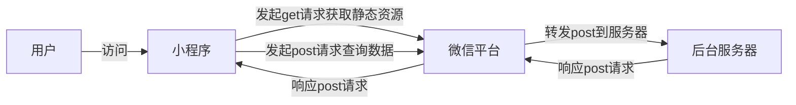
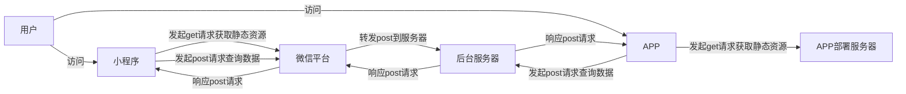

[TOC]

# 移动端兼容

## 小程序

### `scroll-view`在部分IOS手机上无法滑动

【问题描述】

在部分IOS手机上，scroll-view内容超出设置高度后无法滑动。

【问题原因】

经过跟踪发现scroll-view在部分IOS上无法兼容下拉刷新，和滑动事件。

【解决方案】

使用touchmove事件监听实现下拉刷新功能，并封装成组件，组件内部使用scroll-view实现内部滚动即可。

**说明**：

touchStart和touchend事件在scroll-view全阶段都可以触发；

touchmove只有在scroll-view到顶部了往下滑，或者到底部了往上滑才可以触发，中间滚动的时候，不会触发touchmove事件。

### input组件设置placeholder样式不能设置opacity

【问题描述】

```html
<input type='text' placeholder-style="color:#000;opacity:0.4;" style="color:#000;opacity:0.8">
```

手机上，input聚焦时，placeholder会显示为透明度为0.8，而不是0.4

【问题原因】

微信原生input组件设置placeholder的样式时，不能设置opacity属性，否则会在聚焦时产生穿透，导致placeholder的颜色发生错乱。

【解决方案】

设置placeholder样式时，不设置opacity属性

###  textarea组件无法被modal覆盖

【问题描述】

小程序使用了textarea组件后，弹出层，或者弹窗无法覆盖textarea的内容，会导致内容出现穿透

【问题原因】

微信小程序的textarea组件层级太高，导致其他元素无法覆盖，就算z-index设置为9999也没有用

【解决方案】

出现弹窗的时候，将textarea组件替换为view显示

### input聚焦时快速点击按钮显示遮罩层，input不会被覆盖

【问题描述】

在点击input输入框聚焦后，快速点击按钮或者内容显示遮罩层，发现遮罩层无法覆盖input输入框，input输入框显示光标闪烁，以及可以输入内容

【问题原因】

input输入微信小程序客户端撞见的原生组件，脱离了webview渲染流程外，层级最高，无论z-index多少，都无法被覆盖。

【解决方案】

1. 出现弹窗的时候，将input组件替换为view显示
2. 监听input组件的keyboardheightchange事件，并在回调函数中判断如果有显示遮罩则调用`uni.hideKeyboard();`隐藏软键盘，不能使用focus事件，测试过程中发现focus事件是个异步事件，不可控，导致概率性无法隐藏软键盘

### scroll-view的scrolltolower事件在下滑过快的时候无法触发

【问题描述】

scroll-view滚动区域在下滑过快的时候，不会触发scrolltolower加载更多，需要向上滑动一点点才可以触发。
【问题原因】

scroll-view的加载更多事件实际上是监听的滚动区域到底部的距离，如果下滑过快，导致监听不到底部距离的变化，从而无法触发加载更多的事件。

【解决方案】

**方案一**：

设置`lower-threshold`距离底部距离小于这个阈值时触发scrolltolower事件，设置为200。给一个比较大的距离，能够让下滑过快的时候，也能够监听到距离小于阈值触发加载更多。

【优点】：

200的距离足够手机监听到距离的变化，改动简单方便。

【缺点】：

如果使用toast提示没有更多条目时，200这个距离下滑的时候，会不停触发toast提示。

除非改成底部提示没有更多数据。

**方案二**：

放弃scroll-view的原生scrolltolower事件，自己监听touchmove事件。

在触发touchstart事件时，记录初始y坐标，触发touchmove事件时，判断y坐标偏移是否超过阈值，如果有则触发下拉刷新，或者加载更多事件。

同时需要记录初始x坐标，防止x坐标偏移多大。

【优点】：

可以使用toast提示或者底部提示，提示更加准确。

【缺点】：

无法自动触发加载更多事件，需要滑动到底部后，用户继续上拉，才能触发加载更多。

### wx.location定位fail原因汇总

fail返回的对象 errMsg 可能返回的值，需要根据错误原因，toast提示用户不同的信息。

- `getLocation:fail auth deny`：用户在小程序中未授权

- `getLocation:fail:auth denied`：用户在小程序中未授权

- `getLocation:fail authorize no response` ：用户在小程序中未授权 （新老版本、平台返回不同）

- `getLocation:fail system permission denied`：未给微信位置授权

- `getLocation:fail:ERROR_NOCELL&WIFI_LOCATIONSWITCHOFF`：没开启系统定位

- `getLocation:fail:ERROR_NETWORK`：网络异常

- `getLocation:fail:timeout`：定位超时

## H5

### Refused to set unsafe header "cookie"

【问题描述】

H5模式下跨域请求的时候报错：Refused to set unsafe header "Cookie"
导致无法携带Cookie登录

【问题原因】

W3C规范规定在部分请求头部是禁止修改的，其中Cookie就是一个

但是如果H5前端和后台部署在一起的时候，也没有碰到这个问题，因此这个禁止应该是在跨域的时候会有这个问题。

【解决方案】

H5模式下，浏览器会自动处理cookie不需要手动设置，因此H5模式下通过条件编译移除Cookie的头部设置即可

### max-height导致子元素设置height:100%超出高度时会溢出

【问题描述】

结构如下所示，如果子元素的内容高度超出100后，内容会溢出，而且无法滚动。

```
<view style="max-height:500px">
	<scroll-view style="height:100%">
	</scroll-view>
</view>
```

【问题原因】

父元素设置了max-height属性时，子元素设置百分比高度属性无法生效，因为页面元素高度是从里往外计算的，如果父元素没有设置一个确定的高度，子元素百分比高度计算无法计算。

【解决方案】

父元素设置固定高度即可。

### h5网页input的type设置为number，maxlength属性无效

【问题描述】

设置了number的input，在h5模式下maxlength会失效。

```
<input type="number" maxlength="11" >
```

【问题原因】

input组件兼容性问题

【解决方案】

```
<input type="number " oninput="checkTextLength(this ,11)">
<script type="text/javascript ">
    function checkTextLength(obj, length) {
        if(obj.value.length > length)  {
            obj.value = obj.value.substr(0, length);
        }
    }
</script>
```

### APP内嵌H5无法获取定位信息

【问题描述以及原因】

H5：安卓手机在原生App内嵌H5时，无法定位需要原生App处理Webview。

> https://uniapp.dcloud.io/api/location/location?id=getlocation
>
> https://www.jianshu.com/p/3147e5d59006

【解决方案】

和APP原生交互获取

### H5模式css3的var函数没有生效

【问题描述】

在H5模式中使用评分组件时，使用了css3的var函数设置margin-left，但是发现没有生效

```
$gutter: var(--gutter);
.rate {
	margin-left: $gutter;
}
```

【问题原因】

因为gutter变量使用了rpx单位

【解决方案】

将rpx转换为px单位即可。

### APP内嵌H5碰到”连接服务器超时，点击屏幕重试“

【问题描述】

在原生APP内嵌H5，点击路由跳转的时候会出现`连接服务器超时，点击屏幕重试`的错误。

【问题原因】

和APP联调的时候，由于频繁更新服务器文件，导致入口文件都是一样的名称index.html，但是其他的文件会由于重编译的原因，文件名称被修改，导致使用旧的缓存index文件请求旧的路由文件会出现错误。

> https://ask.dcloud.net.cn/question/92660

【解决方案】

APP访问的时候，忽略缓存，始终访问最新的web文件即可。


## 小程序 && H5

### ios最后一个margin-bottom无效

【问题描述】

ios手机开发小程序，以及H5应用时，最后一个节点的`margin-bottom`无效。

【问题原因】

IOS手机兼容性问题。

【解决方案】

使用`padding-bottom`，或者设置高度为所需高度的分割条。

### scroll-view未被占满时也会出现滚动

【问题描述】

scroll-view设置为高度500px，内容只有100px，但是也会出现滚动的现象

【问题原因】

当 scroll-view 组件的第一个直接子元素设置了 `margin-top` 时即使 scroll-view 只有一行也可以滚动。

【解决方案】

去掉第一个元素的 margin-top

### 0.5px分割线在部分手机特殊情况下绘制不出来

【问题描述】

使用border或者height实现0.5px的分割线时，有的时候能显示，有的时候分割线突然消失。

【问题原因】

不清楚具体原因，不过根据调试发现，如果设置的高度不是整数的情况下，会导致分割线显示不完整。

【解决方案】

如果高度不是整数时，尽量设置整数的高度，凑整。

# PC浏览器兼容

## 通有问题

### enter按键会刷新当前页面

【问题描述】

填写表单时，按下enter按键，会导致当前页面被刷新

【问题原因】

浏览器默认行为。

如果form表单中只有一个input时，enter按键会自动触发submit行为提交表单，而form表单的action为空时，会刷新当前页面

【解决方案】

方案一：

给form表单绑定submit事件，return false；或者使用prevent阻止默认行为

方案二：

给input绑定keydown事件，监听keyCode为13时，阻止默认行为

### 前后端分离cookie无法设置的问题

【问题描述】

前后端部署分离，且在不同的域名情况下，后台通过`set-cookie`无法设置cookie，导致无法完成鉴权。

【问题原因】

Chrome 51 开始，浏览器的 Cookie 新增加了一个`SameSite`属性，用来防止 CSRF 攻击和用户追踪。禁止第三方cookie的设置，以及禁止携带cookie。

【解决方案】

> https://blog.csdn.net/weixin_40686603/article/details/105265565

1. 后端修改

   - 设置`Access-Control-Allow-Origin`为指定域名，不能用`*`，否则无法设置cookie

   - 设置`Access-Control-Allow-Credentials`为true，告知前端可以请求头携带cookie

2. 前端修改

   - `axios.defaults.withCredentials = true`指示允许使用cookie创建一个跨站控制请求，同域名下设置此属性无效

### 前后端Cookie鉴权方案设计

【问题背景】

正常情况下前后端的交互如下图所示：

```sequence
participant 前端
participant 后台

前端 -> 后台: 1.login:request发起登录请求
后台 -> 前端: 2.login:response，携带Set-Cookie响应头部
前端 -> 前端: 3.浏览器识别到Set-Cookie响应头部，设置到Cookie中
前端 -> 后台: 4.queryUserInfo:request发起请求时会携带Cookie
后台 -> 后台: 5.后台收到请求后，会对Cookie进行鉴权
后台 -> 前端: 6.queryUserInfo:response，鉴权通过后返回的响应
```

前后端分开部署的情况如下图所示，相比上一个图而言，多出了前三步。

```sequence
participant 前端
participant 后台

前端 -> 前端: 0.设置baseUrl为后台部署的域名
前端 -> 前端: 1.设置withCredentials为true，以允许使用cookie创建跨站请求
后台 -> 后台: 2.设置Access-Control-Allow-Origin为前端域名，不能设置为*
后台 -> 后台: 3.设置Access-Control-Allow-Credentials为true，允许前端携带cookie请求
前端 -> 后台: 4.login:request发起登录请求
后台 -> 前端: 5.login:response，携带Set-Cookie响应头部，以及
前端 -> 前端: 6.浏览器识别到Set-Cookie响应头部，设置到Cookie中
前端 -> 后台: 7.queryUserInfo:request发起请求时会携带Cookie
后台 -> 后台: 8.后台收到请求后，会对Cookie进行鉴权
后台 -> 前端: 9.queryUserInfo:response，鉴权通过后返回的响应
```

正常情况下小程序和后台交互如下图所示：



但是小程序和H5的后台共用时如下图所示：



小程序和H5都是使用Cookie的请求header进行鉴权时，小程序由于是微信后台转发了请求，所以不会存在跨域的问题，而H5会有跨域的问题，所以需要设置如下：

- 设置`Access-Control-Allow-Origin`为指定域名，不能用`*`，否则无法设置cookie
- 设置`Access-Control-Allow-Credentials`为true，告知前端可以请求头携带cookie

但是如果设置了允许域名为指定域名后，会导致小程序无法访问，因为小程序的域名和H5的域名不一致。

但是如果不设置成上述属性，只设置`Access-Control-Allow-Origin:*`会导致H5模式无法设置cookie，因为cookie的`sameSite`特性不允许第三方设置cookie，从而H5无法完成鉴权。

【解决方案】

方案一：

修改小程序和H5的鉴权字段，抛弃Cookie，使用`Authorization`字段进行鉴权

方案二：

小程序和H5分开请求访问不同的端口，H5的请求端口跨域设置为指定域名，小程序的则不做设置。

方案三（推荐）：

前后端部署在一起，这样就不会有跨域的问题了。

### type为number的input会导致maxlength失效

【问题描述】

通过动态设置input的type为number，并设置maxlength为11，在H5模式下，长度限制会失效

【问题原因】

组件兼容性问题

【解决方案】

input的type设置成固定的number，不要动态设置即可

## IE


## safari

### 使用blob下载文件时，低版本safari上无法下载

【问题描述】

使用blob接受二进制流文件，保存下载文件的操作，在低版本的safari上无法下载

【问题原因】

低版本的safari不兼容blob，导致无法下载文件

【解决方案】

后台提供要下载的文件url给前端，使用a标签下载即可


